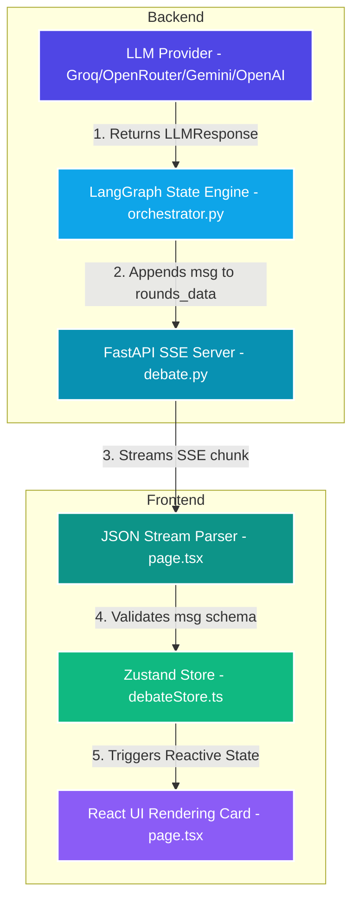

# ⚔️ Syntax Showdown

<p align="center">
  
  
  
  
</p>

**Syntax Showdown** is a premium, real-time, multi-agent AI debate platform. It pits advanced LLMs against each other in structured, moderated battles adjudicated by an impartial AI "Judge" agent.

The platform utilizes **LangGraph** for complex state orchestration, streams results using **Server-Sent Events (SSE)**, maintains historical records in **ChromaDB Cloud**, and features comprehensive cost and token observability telemetry.

---

## ⚡ Data Flow Architecture

The data flow is fully unified and standardized across every layer:



---

## 📋 Standardized Message Schema

Every message in the system conforms to the exact same JSON schema. This ensures zero data loss and flawless card rendering:

```json
{
  "id": "string (UUID v4 or unique identifier)",
  "role": "string ('pro' | 'opponent' | 'judge' | 'system' | 'error' | 'sides')",
  "content": "string (canonical content; JSON-stringified for complex structures like judge/sides)",
  "round": "number (integer; current round number)",
  "provider": "string (active LLM provider, e.g. 'groq')",
  "timestamp": "string (ISO-8601 UTC timestamp)"
}
```

### Content Structures
- **Arguments (`pro` / `opponent`)**: Raw markdown or text bullet points.
- **Debate Briefing (`sides`)**: JSON-stringified object containing:
  ```json
  { "pro": "Pro side stance", "opponent": "Opponent side stance" }
  ```
- **Judge Adjudication (`judge`)**: JSON-stringified object containing:
  ```json
  {
    "winner": "Pro | Opponent",
    "scores": {
      "Pro": { "logic": 1-10, "evidence": 1-10, "rebuttal": 1-10 },
      "Opponent": { "logic": 1-10, "evidence": 1-10, "rebuttal": 1-10 }
    },
    "pro_summary": ["Point 1", "Point 2", "Point 3"],
    "opponent_summary": ["Point 1", "Point 2", "Point 3"],
    "reason": "Clash point details..."
  }
  ```

---

## 🚀 Key Features

- **Multi-Agent Orchestration**: LangGraph coordinates the state machine (Pro ➔ Opponent ➔ Judge).
- **Dynamic Failover Chain**: Automatically fails over (Groq ➔ OpenRouter ➔ Gemini ➔ OpenAI) on rate limits (HTTP 429) or service outages with failover audit logs.
- **Local Heuristics Fallback**: If all LLM APIs fail, a fallback heuristic evaluation engine calculates the winner locally from token/word metrics without crashing the debate.
- **Cost & Token Observability**: Tracks latency, prompt/completion tokens, request costs, debate costs, and cumulative session costs.
- **Memory Persistence**: Integrates ChromaDB Cloud to persist, retrieve, and search debate history.
- **Cyberpunk UI**: Responsive dark/glassmorphic interface with Framer Motion animations.

---

## ⚙️ Installation & Setup

### 1. Prerequisites
- **Node.js**: v18+
- **Python**: v3.10+

### 2. Environment Configuration

#### Backend (`/backend/.env`)
```env
PRIMARY_PROVIDER=groq
ENABLE_FAILOVER=true

GROQ_API_KEY=your_groq_api_key_here
OPENROUTER_API_KEY=your_openrouter_api_key_here
GEMINI_API_KEY=your_gemini_api_key_here
OPENAI_API_KEY=your_openai_api_key_here

CLERK_SECRET_KEY=sk_test_...
CLERK_JWKS_URL=https://.../.well-known/jwks.json

CHROMA_HOST=api.trychroma.com
CHROMA_API_KEY=ck-...
CHROMA_TENANT=your_tenant_id_here
CHROMA_DATABASE=Syntax-Showdown
```

#### Frontend (`/frontend/.env.local`)
```env
NEXT_PUBLIC_CLERK_PUBLISHABLE_KEY=pk_test_...
CLERK_SECRET_KEY=sk_test_...
NEXT_PUBLIC_API_URL=http://localhost:8000
```

---

## 🏃 Running the Project

### Start the Backend FastAPI Server
1. Navigate to `/backend`:
   ```bash
   cd backend
   ```
2. Activate virtual environment:
   ```bash
   # Windows
   .\venv\Scripts\activate
   # macOS/Linux
   source venv/bin/activate
   ```
3. Install dependencies:
   ```bash
   pip install -r requirements.txt
   ```
4. Run:
   ```bash
   uvicorn app.main:app --reload
   ```

### Start the Next.js Frontend
1. Navigate to `/frontend`:
   ```bash
   cd frontend
   ```
2. Install dependencies:
   ```bash
   npm install
   ```
3. Run:
   ```bash
   npm run dev
   ```

Frontend is accessible at [http://localhost:3000](http://localhost:3000), backend API at [http://localhost:8000](http://localhost:8000).

---

## 🧪 Testing

Run backend tests verifying failover behavior, telemetry logging, and local heuristic backups:
```bash
cd backend
pytest app/tests/test_llm_failover.py -v
```

---

## 📜 License & Author
MIT License. Created with ❤️ by Gaurav Singh.
